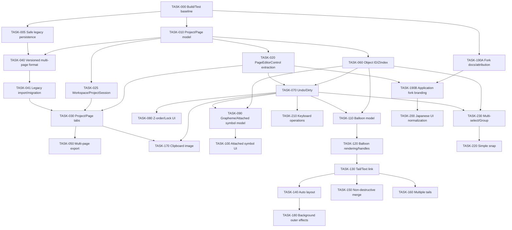

# 依存関係付きタスク分解

Status: Initial plan

Priority: P0（基盤/安全性）、P1（主要機能）、P2（拡張）、P3（将来）

## 1. 依存DAG

循環はない。`MainWindow`、保存形式、test solutionを複数workerが同時変更しないよう直列境界を置く。

## 2. タスク仕様

### TASK-000 ビルド基準とcharacterization test harness

- **目的・価値・優先度:** 再現可能なDebug/Release buildと既存挙動の防波堤を作る。P0。
- **要件:** REQ-NFR-BUILD-001, REQ-NFR-TEST-001, REQ-NFR-PERF-001。**依存:** なし。**後続:** ほぼ全task。
- **Scope:** SDK方針、build script、test project、legacy XML/zip fixture、現行model round-trip、最小CI候補。**Out:** 製品機能修正、framework upgrade。
- **予想file:** solution/csproj、新規 `tests/*`, `eng/*`。既存product C#は原則変更しない。solution競合が高いため他taskはsolutionを触らない。
- **Interface/影響:** test seamのみ。UI/format変更なし。fixtureは現行formatの観測値を固定。
- **受入:** Debug/Release、test commandが成功し結果を記録。現在環境はSDK不在のため、導入前はBlockedと正直に報告。
- **検証:** build/test、baseline scenario定義。縦横fixtureを含む。**Rollback:** 追加project/scriptをrevert。
- **Branch/worktree:** `feature/TASK-000-build-baseline` / `../MojiCollaTool-worktrees/TASK-000`。
- **注意:** 未確認挙動を仕様として正当化せず、characterizationとdesired behaviorを区別する。

### TASK-005 現行形式の安全な保存・読込

- **目的・価値・優先度:** 旧file先行削除、stale XML、破損読込による状態喪失を解消。P0。
- **要件:** REQ-SAVE-001, REQ-COMPAT-001, REQ-NFR-ERROR-001。**依存:** TASK-000。**後続:** 040。
- **Scope:** isolated temp workspace、stale file排除、一時zip＋検証＋replace、読込commit point。**Out:** multipage format。
- **予想file:** `DataIO.cs`, `MainWindow.xaml.cs`, persistence tests。MainWindow/保存処理競合高。
- **Interface/影響:** 既存public methodをadapter維持。日本語error改善。現行mctzip構造は維持。
- **受入:** fault injectionで旧file/session保持、削除文字非復活、正常round-trip。
- **検証:** Debug/Release、zip fixture、日本語path、corrupt zip。縦横文字保持。**Rollback:** 新writer/loaderを一括revert。
- **Branch/worktree:** `feature/TASK-005-safe-legacy-persistence` / `TASK-005`。

### TASK-010 ProjectDocument／PageDocumentモデル

- **目的・価値・優先度:** 保存可能な1 project複数page状態をUIから分離。P0。
- **要件:** REQ-PAGE-001, REQ-WORKSPACE-001。**依存:** TASK-000。**後続:** 020,025,040,060。
- **Scope:** Project/Page/Canvas document、page ID/name/order、legacy data adapter、clone semantics。**Out:** tabs、new serializer、UI抽出。
- **予想file:** 新規document model、既存data adapter、tests。MainWindowは変更しない。
- **Interface/影響:** serialization-neutral domain API。UIなし、format未変更、compat mapper準備。
- **受入:** page CRUD/reorder/clone単体test、初期名、deep copy、同一ID禁止。
- **検証:** test/build、縦横MojiData保持。**Rollback:** 新規model/adapter削除。
- **Branch/worktree:** `feature/TASK-010-project-page-model` / `TASK-010`。

### TASK-020 PageEditorControl抽出

- **目的・価値・優先度:** pageごとのCanvasと操作を再利用可能にする。P0。
- **要件:** REQ-PAGE-001, REQ-NFR-MEM-001。**依存:** TASK-010。**後続:** 030,070,190B。
- **Scope:** MainCanvas、image/object host、zoom、drop、dialog接続を段階抽出。**Out:** tabs、新機能。
- **予想file:** `MainWindow.*`, 新規 `PageEditorControl.*`, MojiPanel接続adapter。競合非常に高。
- **Interface/影響:** shell command/event interface。既存日本語UIと挙動維持、format影響なし。
- **受入:** 単page基準scenarioが抽出前後で同等、detach時Window参照解放。
- **検証:** build/test/manual、縦横描画/drag/export。**Rollback:** MainWindow内hostへ戻す単一commit。
- **Branch/worktree:** `feature/TASK-020-page-editor-control` / `TASK-020`。

### TASK-025 ApplicationWorkspace／ProjectSession

- **目的・価値・優先度:** 複数projectの状態隔離をUI前に実装。P0。
- **要件:** REQ-WORKSPACE-001, REQ-DIRTY-001。**依存:** TASK-010。**後続:** 030。
- **Scope:** session collection、active project/page、FilePath、重複path、close policy。**Out:** visual tabs、serializer変更。
- **予想file:** 新規workspace/session serviceとtests。MainWindow変更なし。
- **Interface/影響:** observable shell-facing state。UI/format直接影響なし。
- **受入:** 2projectのpage/dirty/file状態が混在せず、closeで解放。
- **検証:** state tests。**Rollback:** 新規service削除。
- **Branch/worktree:** `feature/TASK-025-project-session` / `TASK-025`。

### TASK-030 プロジェクトタブ／ページタブUI

- **目的・価値・優先度:** browser型workspaceを二段tabで提供。P0。
- **要件:** REQ-PAGE-001, REQ-WORKSPACE-001, REQ-DIRTY-001, REQ-UI-JA-001。**依存:** 020,025,041。**後続:** 050,170。
- **Scope:** project open/new/save/close tab、page add/duplicate/delete/rename/reorder、unsaved mark。**Out:** tab group collapse、cross-project page move。
- **予想file:** MainWindow shell XAML/CS、tab viewmodel/control。競合非常に高。
- **Interface/影響:** workspace/session API。日本語UI大、formatは既存serializer利用。
- **受入:** 2projects×3pagesを独立操作、同一file二重防止、個別close確認。
- **検証:** build/test/manual、日本語、keyboard focus、縦横page切替。**Rollback:** feature flagまたはUI commit revert。
- **Branch/worktree:** `feature/TASK-030-project-page-tabs` / `TASK-030`。

### TASK-040 バージョン化複数ページ保存形式

- **目的・価値・優先度:** manifest/pages構造で複数pageと将来拡張を安全保存。P0。
- **要件:** REQ-SAVE-001, REQ-PAGE-001, REQ-OBJECT-001。**依存:** 005,010。**後続:** 041。
- **Scope:** manifest DTO、page serializer、version gate、atomic writer。**Out:** legacy mapping UI。
- **予想file:** persistence層、新format DTO/tests、`DataIO` adapter。保存競合非常に高。
- **Interface/影響:** `IProjectReader/Writer`候補。UIはerrorのみ、format影響最大。
- **受入:** multipage round-trip、unknown version拒否、fault安全、zip traversal防止。
- **検証:** fixture/fault/日本語path/build。**Rollback:** new writer登録を外し旧readは維持。
- **Branch/worktree:** `feature/TASK-040-versioned-project-format` / `TASK-040`。

### TASK-041 旧形式読込と移行

- **目的・価値・優先度:** 旧mctzipをpage 1へ損失なく変換。P0。
- **要件:** REQ-COMPAT-001。**依存:** 040。**後続:** 030。
- **Scope:** legacy detector/reader/mapper、warning、fixture。**Out:** 公式互換export。
- **予想file:** legacy persistence adapter/tests。MainWindow直接変更を避ける。
- **Interface/影響:** common reader result。日本語移行UI小、format read影響大。
- **受入:** 代表fixture、画像0/1/2枚、複数Moji、未知field toleranceの期待を記録。
- **検証:** golden fixture、縦横/Unicode、日本語path。**Rollback:** legacy reader registrationをrevert。
- **Branch/worktree:** `feature/TASK-041-legacy-project-import` / `TASK-041`。

### TASK-050 全ページ一括出力

- **目的・価値・優先度:** scenario全pageを順番に出力。P1。
- **要件:** REQ-EXPORT-001。**依存:** 030。**後続:** なし。
- **Scope:** current/all page、連番、collision/error summary。**Out:** PDF/video。
- **予想file:** export service、shell UI、tests。MainWindow競合中。
- **影響/受入:** 日本語UI、formatなし。page順/寸法/alpha/JPEGを確認。
- **検証/rollback:** build/test/manual、失敗page継続policy。service/UI commit revert。
- **Branch/worktree:** `feature/TASK-050-batch-page-export` / `TASK-050`。

### TASK-060 共通オブジェクトIDとZIndex

- **目的・価値・優先度:** link/Undo/Z順の安定参照。P0。
- **要件:** REQ-OBJECT-001, REQ-ZORDER-001。**依存:** 010。**後続:** 070,090,110,230。
- **Scope:** identity/state component、legacy ID mapping、order normalization。**Out:** UI操作、一般group。
- **予想file:** object model、Moji adapter、serializer DTO/tests。MainWindow変更なし。
- **影響/受入:** UIなし、format ID/Z追加。duplicate/reload/normalize tests。
- **検証/rollback:** build/test、縦横不変。adapterとschema changeをrevert。
- **Branch/worktree:** `feature/TASK-060-object-id-zindex` / `TASK-060`。

### TASK-070 Undo／Redo・dirty基盤

- **目的・価値・優先度:** 可逆編集と正しい未保存表示。P0。
- **要件:** REQ-UNDO-001, REQ-DIRTY-001, REQ-NFR-MEM-001。**依存:** 020,060。**後続:** 080,090,110,170,210,230。
- **Scope:** command/history/transaction/coalesce、saved revision、position/add/delete/style/page operationsの基盤。**Out:** 全feature固有command。
- **予想file:** history service、PageEditor input、MainWindow command bindings、tests。競合非常に高。
- **影響/受入:** 日本語操作名、format原則なし。drag 1件、redo branch破棄、save marker、limit。
- **検証/rollback:** state/integration/manual、縦横drag。command routing一括revert。
- **Branch/worktree:** `feature/TASK-070-undo-dirty` / `TASK-070`。

### TASK-080 重なり順とロックUI

- **目的・価値・優先度:** 軽量な前後移動・保護操作。P1。
- **要件:** REQ-ZORDER-001, REQ-LOCK-001, REQ-UI-JA-001。**依存:** 070。**後続:** なし。
- **Scope:** context menu/small toolbar、command、hit test policy、保存。**Out:** layer panel。
- **予想file:** PageEditor、object command、serializer/tests。UI競合中。
- **受入:** 6日本語operation、Undo/round-trip、group内部順規則。
- **検証/rollback:** build/test/manual、縦横。UI/command commit revert。
- **Branch/worktree:** `feature/TASK-080-zorder-lock` / `TASK-080`。

### TASK-090 書記素・付加記号データモデル

- **目的・価値・優先度:** char破損を解消しattached symbolを保存可能にする。P1。
- **要件:** REQ-SYMBOL-001, REQ-NFR-UNICODE-001。**依存:** 060,070。**後続:** 100。
- **Scope:** grapheme segmentation、anchor、offset/em、inherit flags、親変更policy。**Out:** UI/preset。
- **予想file:** text model/renderer adapter/serializer/tests。文字描画競合高。
- **受入:** surrogate/combining/emoji fixture、parent delete/change、round-trip/Undo。
- **検証/rollback:** build/test、複数font縦横。feature adapterをrevert。
- **Branch/worktree:** `feature/TASK-090-attached-symbol-model` / `TASK-090`。

### TASK-100 付加記号UIと縦書き配置

- **目的・価値・優先度:** 記号追加・個別調整を提供。P1。
- **要件:** REQ-SYMBOL-001, REQ-UI-JA-001。**依存:** 090。**後続:** symbol preset。
- **Scope:** add/remove/select/drag、X/Y/scale/rotate/inherit UI、縦横default。
- **予想file:** text editor/PageEditor XAML/CS、renderer/tests。UI競合高。
- **受入:** 全candidate記号、任意短文、Undo、inherit、font差手動確認。
- **検証/rollback:** build/test/manual縦横。UI/renderer commit revert。
- **Branch/worktree:** `feature/TASK-100-attached-symbol-ui` / `TASK-100`。

### TASK-110 フキダシ基本モデル

- **目的・価値・優先度:** shape/style/tail/linkの保存基盤。P1。
- **要件:** REQ-BALLOON-001/002。**依存:** 060,070。**後続:** 120。
- **Scope:** BalloonData/shape/style、single-tail slot、relationship DTO、commands。**Out:** drawing/handles。
- **予想file:** new model/serializer/command/tests。MainWindow変更なし。
- **受入:** shape/style/clone/round-trip/Undo、未知shapeの安全な扱い。
- **検証/rollback:** build/test。新規型/schemaをrevert。
- **Branch/worktree:** `feature/TASK-110-balloon-model` / `TASK-110`。

### TASK-120 フキダシ描画と編集handle

- **目的・価値・優先度:** 基本shapeを追加・移動・resize。P1。
- **要件:** REQ-BALLOON-001, REQ-NFR-PERF-001。**依存:** 110。**後続:** 130。
- **Scope:** Geometry factory/cache、render、hit test、selection/resize handles、drag preview。
- **予想file:** PageEditor/balloon visual/new geometry tests。UI/render競合高。
- **受入:** 4shape候補、style、drag 1履歴、cache benchmark、日本語追加UI。
- **検証/rollback:** build/test/manual、縦横文字との重なり。visual registrationをrevert。
- **Branch/worktree:** `feature/TASK-120-balloon-editor` / `TASK-120`。

### TASK-130 しっぽ編集・文字リンク

- **目的・価値・優先度:** tailとlinked textを一体操作。P1。
- **要件:** REQ-BALLOON-002。**依存:** 120。**後続:** 140,150,160。
- **Scope:** add/remove、tip/root/width handles、link/unlink、一体move/Z。
- **予想file:** balloon visual/model command/PageEditor/tests。競合高。
- **受入:** hit test、Undo、round-trip、parent/text delete policy、drag性能。
- **検証/rollback:** build/test/manual縦横。tail/link feature revert。
- **Branch/worktree:** `feature/TASK-130-balloon-tail-link` / `TASK-130`。

### TASK-140 自動改行・中央配置・自動縮小

- **目的・価値・優先度:** frame/textの予測可能な自動layout。P1。
- **要件:** REQ-LAYOUT-001。**依存:** 130。**後続:** 180。
- **Scope:** 2 layout modes、padding、wrap、center、minimum size、overflow warning、manual override。
- **予想file:** layout service、text/balloon/background UI、tests。文字描画競合高。
- **受入:** no feedback loop、1 Undo、縦横golden cases、performance threshold。
- **検証/rollback:** unit/integration/manual。layout serviceとUI revert。
- **Branch/worktree:** `feature/TASK-140-auto-text-layout` / `TASK-140`。

### TASK-150 非破壊フキダシ合体

- **目的・価値・優先度:** 明示合体/解除で元shape保持。P3。
- **要件:** REQ-BALLOON-MERGE-001。**依存:** 130,230推奨。**後続:** なし。
- **Scope:** composite data、inner stroke suppression、cache/Undo。**Out:** auto merge。
- **予想file:** balloon geometry/model/UI/tests。format/UI影響大。
- **受入:** 合体解除で元parameter復元、overlap/non-overlap安全。
- **検証/rollback:** geometry/round-trip/perf/manual。feature registration revert。
- **Branch/worktree:** `feature/TASK-150-balloon-merge` / `TASK-150`。

### TASK-160 複数しっぽ

- **目的・価値・優先度:** 1本実装を複数へ拡張。P3。
- **要件:** REQ-BALLOON-TAILS-001。**依存:** 130。**後続:** なし。
- **Scope:** tail collection、個別選択、order/delete。format/UI影響あり。
- **受入/検証:** 0..n tail round-trip/Undo/hit test/manual。collection change revert。
- **Branch/worktree:** `feature/TASK-160-multiple-balloon-tails` / `TASK-160`。

### TASK-170 クリップボード画像読込

- **目的・価値・優先度:** background取得を高速化。P1。
- **要件:** REQ-CLIPBOARD-001。**依存:** 030,070。**後続:** なし。
- **Scope:** clipboard adapter、新page/replace choices、alpha/DPI/error、Undo。
- **予想file:** image service、PageEditor/shell UI/tests。UI競合中。
- **受入:** imageなし日本語message、exception継続、既存背景確認、round-trip。
- **検証/rollback:** Windows STA integration/manual。adapter/UI revert。
- **Branch/worktree:** `feature/TASK-170-clipboard-image` / `TASK-170`。

### TASK-180 背景枠の外側縁取り・blur

- **目的・価値・優先度:** 背景frameの追加表現。P2。
- **要件:** REQ-BACKGROUND-FX-001。**依存:** 140。**後続:** なし。
- **Scope:** second stroke/glow parameters/render/UI、既存code再利用。format/UI影響あり。
- **受入:** radius 0で硬い第2stroke、opacity、performance/round-trip。
- **検証/rollback:** render/manual縦横/build。properties/render revert。
- **Branch/worktree:** `feature/TASK-180-background-outer-effect` / `TASK-180`。

### TASK-190A リポジトリの勝手版表記と第三者帰属

- **目的・価値・優先度:** 非公式版の誤認防止とlicense順守。P0。
- **要件:** REQ-FORK-001, REQ-NFR-DEPS-001。**依存:** なし。**後続:** 190B。
- **Scope:** README、third-party code由来調査、必要なnotice、問い合わせ注意。**Out:** app title/About/product binary。
- **予想file:** `README.md`, new `THIRD-PARTY-NOTICES.md`, CHANGELOG。product codeなし、競合低。
- **受入:** 元MITを維持、未確認licenseを断定せず一次source evidenceを報告、download/wikiを勝手版向けに修正。
- **検証:** link/文言/license review。buildはproduct非変更のためNot applicable可。**Rollback:** docs commit revert。
- **Branch/worktree:** `feature/TASK-190A-fork-documentation` / `../MojiCollaTool-worktrees/TASK-190A`。

### TASK-190B アプリの勝手版表記

- **目的・価値・優先度:** title/About/distributionへ非公式表示。P1。
- **要件:** REQ-FORK-001, REQ-UI-JA-001。**依存:** 020,190A。**後続:** 200。
- **Scope:** product name/title/About、assembly/package metadata。**Out:** installer独自化。
- **予想file:** MainWindow/App/project/AssemblyInfo、新About UI。UI競合高。
- **受入:** 日本語注意書き、原作者へ問い合わせない、MIT表示導線。
- **検証/rollback:** build/manual/distribution inspect。branding commit revert。
- **Branch/worktree:** `feature/TASK-190B-app-branding` / `TASK-190B`。

### TASK-200 既存英語UIの日本語統一

- **目的・価値・優先度:** mixed language解消。P1。
- **要件:** REQ-UI-JA-001。**依存:** 190B。**後続:** なし。
- **Scope:** window title、Moji ID、Before/After、filter、information等のinventoryと修正。**Out:** internal identifiers。
- **予想file:** XAML/CS全般。UI競合高、formatなし。
- **受入:** approved technical abbreviations以外の英語UI 0件。
- **検証/rollback:** string scan/build/manual。localization commit revert。
- **Branch/worktree:** `feature/TASK-200-japanese-ui` / `TASK-200`。

### TASK-210 キーボード微調整と複製

- **目的・価値・優先度:** 頻出操作短縮。P2。
- **要件:** REQ-OPS-001。**依存:** 070。**後続:** なし。
- **Scope:** arrows/Shift, Delete, Ctrl+D、focus guards、Undo。UI tooltip日本語、formatなし。
- **受入/検証:** text inputと衝突せず1 command、縦横/manual/build。binding revert。
- **Branch/worktree:** `feature/TASK-210-keyboard-operations` / `TASK-210`。

### TASK-220 簡易スナップ

- **目的・価値・優先度:** 中央合わせを軽量化。P3。
- **要件:** REQ-SNAP-001。**依存:** 230。**後続:** なし。
- **Scope:** canvas/object center、guide、一時解除、drag transaction。format原則なし。
- **受入/検証:** zoom非依存、複数object、Undo/manual。snap service revert。
- **Branch/worktree:** `feature/TASK-220-simple-snap` / `TASK-220`。

### TASK-230 複数選択と一般グループ

- **目的・価値・優先度:** 一体移動・group化。P2。
- **要件:** REQ-SELECT-001, REQ-GROUP-001。**依存:** 060,070。**後続:** 220,150推奨。
- **Scope:** multi-select、group/ungroup、group transform/Z/lock、保存。**Out:** lasso/layer panel。
- **予想file:** PageEditor/object model/serializer/UI/tests。競合高。
- **受入:** nested policy明記、Undo/round-trip、balloon compositionと混同しない。
- **検証/rollback:** build/test/manual縦横。group feature revert。
- **Branch/worktree:** `feature/TASK-230-multi-select-group` / `TASK-230`。

## 3. 共通完了条件

- 指定要件、ADR、scopeだけを変更し、product buildを維持する。
- 新規UIは日本語、縦書き/横書き、既存format/日本語pathを影響範囲に応じ確認する。
- worker report、ledger、verification matrixを更新し、自branchへ英語messageでcommitする。
- rollbackは原則task commitのrevertで完結させる。
